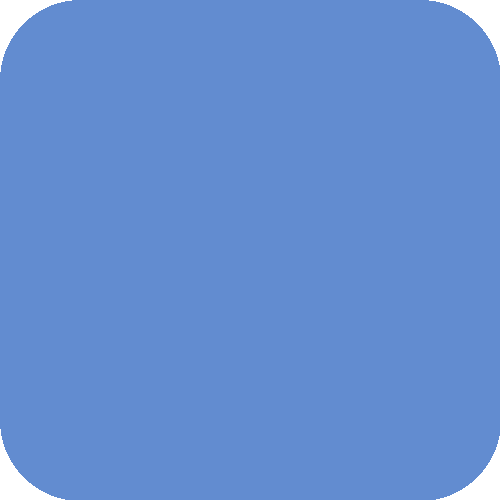

<h2>Echoes of the Medina </h2>

A warm, desert-inspired dual light/dark color palette rooted in the textures, tones, and architecture of Morocco.

<h3>☀️ Desert Kasbah</h3>

<b>A sunlit palette of sandstone walls, spiced earth, and tiled courtyards.</b>

Desert Kasbah reflects the warmth and texture of Moroccan mornings — soft white marbles, clay surfaces, and the dusty golds of the medina. Balanced tones of saffron, rose, and terracotta give clarity and charm to interfaces without overwhelming the senses. Perfect for bright environments or day-focused workflows; a colorway built on readability and quiet elegance.

<b>Aesthetic:</b> Warm, clear, calm. 
<b>Inspirations:</b> White kasbahs, palm leaves, morning tadelakt, date markets, rosewater candies.

<table>
    <tr>
    <th></th>
    <th>Syntax Name</th>
    <th>Color Name</th>
    <th>HEX</th>
    <th>RGB</th>
    <th>HSL</th>
    </tr>
    <tr>
        <td colspan=6>
<b>Interface Colors</b>
</td>
    </tr>
    <tr>
        <td></td>
        <td>bg_dark</td>
        <td>Clay Wall</td>
        <td><code>#E7D9CB</code></td>
        <td><code>rgb(231, 217, 203)</code></td>
        <td><code>hsl(30, 37%, 85%)</code></td>
    </tr>
    <tr>
        <td></td>
        <td>bg_mid</td>
        <td>Sand Courtyard</td>
        <td><code>#F1E9E0</code></td>
        <td><code>rgb(241, 233, 224)</code></td>
        <td><code>hsl(32, 38%, 91%)</code></td>
    </tr>
    <tr>
        <td></td>
        <td>main_bg</td>
        <td>White Marble</td>
        <td><code>#FAF6F1</code></td>
        <td><code>rgb(250, 246, 241)</code></td>
        <td><code>hsl(33, 47%, 96%)</code></td>
    </tr>
    <tr>
        <td></td>
        <td>surface_light</td>
        <td>Medina Beige</td>
        <td><code>#D8C9BA</code></td>
        <td><code>rgb(216, 201, 186)</code></td>
        <td><code>hsl(30, 28%, 79%)</code></td>
    </tr>
    <tr>
        <td></td>
        <td>surface_mid</td>
        <td>Morning Tadelakt</td>
        <td><code>#C7B6A3</code></td>
        <td><code>rgb(199, 182, 163)</code></td>
        <td><code>hsl(32, 24%, 71%)</code></td>
    </tr>
    <tr>
        <td></td>
        <td>surface_dark</td>
        <td>Pastilla Crust</td>
        <td><code>#B5A390</code></td>
        <td><code>rgb(181, 163, 144)</code></td>
        <td><code>hsl(31, 20%, 64%)</code></td>
    </tr>
    <tr>
        <td></td>
        <td>overlay_light</td>
        <td>Earthenware Tagine</td>
        <td><code>#9E8A76</code></td>
        <td><code>rgb(158, 138, 118)</code></td>
        <td><code>hsl(30, 17%, 54%)</code></td>
    </tr>
    <tr>
        <td></td>
        <td>overlay_mid</td>
        <td>Hammam Bronze</td>
        <td><code>#7C6A5A</code></td>
        <td><code>rgb(124, 106, 90)</code></td>
        <td><code>hsl(28, 16%, 42%)</code></td>
    </tr>
    <tr>
        <td></td>
        <td>overlay_dark</td>
        <td>Palm Shade</td>
        <td><code>#635447</code></td>
        <td><code>rgb(99, 84, 71)</code></td>
        <td><code>hsl(28, 16%, 33%)</code></td>
    </tr>
    <tr>
        <td></td>
        <td>text_faint</td>
        <td>Spiced Figs</td>
        <td><code>#55493E</code></td>
        <td><code>rgb(85, 73, 62)</code></td>
        <td><code>hsl(29, 16%, 29%)</code></td>
    </tr>
    <tr>
        <td></td>
        <td>text_muted</td>
        <td>Burnt Cinnamon</td>
        <td><code>#433931</code></td>
        <td><code>rgb(67, 57, 49)</code></td>
        <td><code>hsl(27, 15%, 23%)</code></td>
    </tr>
    <tr>
        <td></td>
        <td>text</td>
        <td>Souk Shadows</td>
        <td><code>#2E2721</code></td>
        <td><code>rgb(46, 39, 33)</code></td>
        <td><code>hsl(28, 16%, 15%)</code></td>
    </tr>
    <tr>
        <td colspan=6>
<b>Syntax Colors</b>
</td>
    </tr>
    <tr>
    <th></th>
    <th>Syntax Name</th>
    <th>Color Name</th>
    <th>HEX</th>
    <th>RGB</th>
    <th>HSL</th>
    </tr>
    <tr>
        <td></td>
        <td>red</td>
        <td>Pomegranate Glaze</td>
        <td><code>#C74030</code></td>
        <td><code>rgb(199, 64, 48)</code></td>
        <td><code>hsl(6, 61%, 48%)</code></td>
    </tr>
    <tr>
        <td></td>
        <td>orange</td>
        <td>Baked Terracotta</td>
        <td><code>#E6733D</code></td>
        <td><code>rgb(230, 115, 61)</code></td>
        <td><code>hsl(19, 77%, 57%)</code></td>
    </tr>
    <tr>
        <td></td>
        <td>yellow</td>
        <td>Ground Turmeric</td>
        <td><code>#E5BD4E</code></td>
        <td><code>rgb(229, 189, 78)</code></td>
        <td><code>hsl(44, 74%, 60%)</code></td>
    </tr>
    <tr>
        <td></td>
        <td>green</td>
        <td>Palm Leaves</td>
        <td><code>#68A85E</code></td>
        <td><code>rgb(104, 168, 94)</code></td>
        <td><code>hsl(112, 30%, 51%)</code></td>
    </tr>
    <tr>
        <td></td>
        <td>teal</td>
        <td>Mosaic Pool</td>
        <td><code>#36A097</code></td>
        <td><code>rgb(54, 160, 151)</code></td>
        <td><code>hsl(175, 50%, 42%)</code></td>
    </tr>
    <tr>
        <td></td>
        <td>cyan</td>
        <td>Desert Spring</td>
        <td><code>#47BCD7</code></td>
        <td><code>rgb(71, 188, 215)</code></td>
        <td><code>hsl(191, 64%, 56%)</code></td>
    </tr>
    <tr>
        <td></td>
        <td>blue</td>
        <td>Fès Cobalt</td>
        <td><code>#3D6BB3</code></td>
        <td><code>rgb(61, 107, 179)</code></td>
        <td><code>hsl(217, 49%, 47%)</code></td>
    </tr>
    <tr>
        <td></td>
        <td>purple</td>
        <td>Saffron Flowers</td>
        <td><code>#9064B4</code></td>
        <td><code>rgb(144, 100, 180)</code></td>
        <td><code>hsl(273, 35%, 55%)</code></td>
    </tr>
    <tr>
        <td></td>
        <td>magenta</td>
        <td>Rosewater Candy</td>
        <td><code>#C05C8D</code></td>
        <td><code>rgb(192, 92, 141)</code></td>
        <td><code>hsl(331, 44%, 56%)</code></td>
    </tr>
</table>

<h3>🌙 Twilight Riad</h3>

<b>A moody palette of lanternlight, deep shadow, and ancient tilework.</b>

Twilight Riad evokes the cool hush of Moroccan nights — worn stone underfoot, candlelight glinting off zellige, and the fading spice of saffron markets. With gentle contrasts and warm undertones, it’s designed for night-time environments, long work sessions, or introspective creative moments. Colors like peppermint, cochineal, and amethyst sit gently against deep backgrounds, offering a rich but non-intrusive visual flow.

<b>Aesthetic:</b> Cozy, immersive, textured. 
<b>Inspirations:</b> Riad courtyards, carved cedar, dusk in the souk, mint tea in the shade.

<table>
    <tr>
    <th></th>
    <th>Syntax Name</th>
    <th>Color Name</th>
    <th>HEX</th>
    <th>RGB</th>
    <th>HSL</th>
    </tr>
    <tr>
        <td colspan=6>
<b>Interface Colors</b>
</td>
    </tr>
    <tr>
        <td></td>
        <td>bg_dark</td>
        <td>Kohl Powder</td>
        <td><code>#1A1713</code></td>
        <td><code>rgb(26, 23, 19)</code></td>
        <td><code>hsl(34, 16%, 9%)</code></td>
    </tr>
    <tr>
        <td></td>
        <td>bg_mid</td>
        <td>Midnight Desert</td>
        <td><code>#231E19</code></td>
        <td><code>rgb(35, 30, 25)</code></td>
        <td><code>hsl(30, 17%, 12%)</code></td>
    </tr>
    <tr>
        <td></td>
        <td>main_bg</td>
        <td>Kasbah Stone</td>
        <td><code>#2E2721</code></td>
        <td><code>rgb(46, 39, 33)</code></td>
        <td><code>hsl(28, 16%, 15%)</code></td>
    </tr>
    <tr>
        <td></td>
        <td>surface_dark</td>
        <td>Tadelakt Clay</td>
        <td><code>#3B332A</code></td>
        <td><code>rgb(59, 51, 42)</code></td>
        <td><code>hsl(32, 17%, 20%)</code></td>
    </tr>
    <tr>
        <td></td>
        <td>surface_mid</td>
        <td>Old Medina</td>
        <td><code>#4C4339</code></td>
        <td><code>rgb(76, 67, 57)</code></td>
        <td><code>hsl(32, 14%, 26%)</code></td>
    </tr>
    <tr>
        <td></td>
        <td>surface_light</td>
        <td>Atlas Earth</td>
        <td><code>#61564A</code></td>
        <td><code>rgb(97, 86, 74)</code></td>
        <td><code>hsl(31, 13%, 34%)</code></td>
    </tr>
    <tr>
        <td></td>
        <td>overlay_dark</td>
        <td>Argan Bark</td>
        <td><code>#7A6D5F</code></td>
        <td><code>rgb(122, 109, 95)</code></td>
        <td><code>hsl(31, 12%, 43%)</code></td>
    </tr>
    <tr>
        <td></td>
        <td>overlay_mid</td>
        <td>Sandstone Arch</td>
        <td><code>#958779</code></td>
        <td><code>rgb(149, 135, 121)</code></td>
        <td><code>hsl(30, 12%, 53%)</code></td>
    </tr>
    <tr>
        <td></td>
        <td>overlay_light</td>
        <td>Saharan Mist</td>
        <td><code>#B9AFA3</code></td>
        <td><code>rgb(185, 175, 163)</code></td>
        <td><code>hsl(33, 14%, 68%)</code></td>
    </tr>
    <tr>
        <td></td>
        <td>text_faint</td>
        <td>Almond Dust</td>
        <td><code>#C6BDB1</code></td>
        <td><code>rgb(198, 189, 177)</code></td>
        <td><code>hsl(34, 16%, 74%)</code></td>
    </tr>
    <tr>
        <td></td>
        <td>text_muted</td>
        <td>Spice Sack</td>
        <td><code>#DAD2C7</code></td>
        <td><code>rgb(218, 210, 199)</code></td>
        <td><code>hsl(35, 20%, 82%)</code></td>
    </tr>
    <tr>
        <td></td>
        <td>text</td>
        <td>Mint Tea Foam</td>
        <td><code>#F4EDE4</code></td>
        <td><code>rgb(244,237, 228)</code></td>
        <td><code>hsl(34, 42%, 93%)</code></td>
    </tr>
    <tr>
        <td colspan=6>
<b>Syntax Colors</b>
</td>
    </tr>
    <tr>
    <th></th>
    <th>Syntax Name</th>
    <th>Color Name</th>
    <th>HEX</th>
    <th>RGB</th>
    <th>HSL</th>
    </tr>
    <tr>
        <td></td>
        <td>red</td>
        <td>Safi Cochineal</td>
        <td><code>#E1756B</code></td>
        <td><code>rgb(225, 117, 107)</code></td>
        <td><code>hsl(5, 66%, 65%)</code></td>
    </tr>
    <tr>
        <td></td>
        <td>orange</td>
        <td>Sunset Leather</td>
        <td><code>#FFAA80</code></td>
        <td><code>rgb(255, 170, 128)</code></td>
        <td><code>hsl(20, 100%, 75%)</code></td>
    </tr>
    <tr>
        <td></td>
        <td>yellow</td>
        <td>Saffron Market</td>
        <td><code>#FFE099</code></td>
        <td><code>rgb(255, 224, 153)</code></td>
        <td><code>hsl(42, 100%, 80%)</code></td>
    </tr>
    <tr>
        <td></td>
        <td>green</td>
        <td>Peppermint Tea</td>
        <td><code>#ADD7A7</code></td>
        <td><code>rgb(173, 215, 167)</code></td>
        <td><code>hsl(112, 38%, 75%)</code></td>
    </tr>
    <tr>
        <td></td>
        <td>teal</td>
        <td>Taza Oasis</td>
        <td><code>#9ADBD4</code></td>
        <td><code>rgb(154, 219, 212)</code></td>
        <td><code>hsl(174, 47%, 73%)</code></td>
    </tr>
    <tr>
        <td></td>
        <td>cyan</td>
        <td>Zellige Tile</td>
        <td><code>#6FD5E7</code></td>
        <td><code>rgb(111, 213, 231)</code></td>
        <td><code>hsl(189, 71%, 67%)</code></td>
    </tr>
    <tr>
        <td></td>
        <td>blue</td>
        <td>Chefchaouen Sky</td>
        <td><code>#628CD0</code></td>
        <td><code>rgb(98, 140, 208)</code></td>
        <td><code>hsl(217, 54%, 60%)</code></td>
    </tr>
    <tr>
        <td></td>
        <td>purple</td>
        <td>Berber Amethyst</td>
        <td><code>#C1A3D7</code></td>
        <td><code>rgb(193, 163, 215)</code></td>
        <td><code>hsl(275, 39%, 74%)</code></td>
    </tr>
    <tr>
        <td></td>
        <td>magenta</td>
        <td>Rose of Essaouira</td>
        <td><code>#DE87B3</code></td>
        <td><code>rgb(222, 135, 179)</code></td>
        <td><code>hsl(330, 57%, 70%)</code></td>
    </tr>
</table>